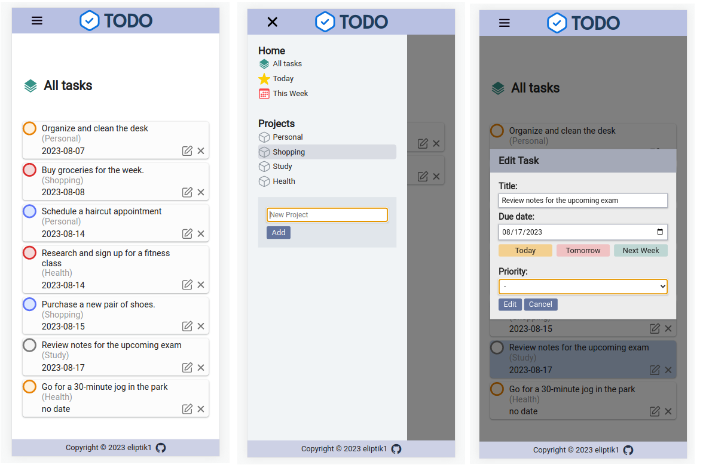

# Todo List

This is a fully responsive Todo application built using HTML, CSS (SCSS), and JavaScript, with project bundling and asset management handled by Webpack. The project incorporates the date-fns library for enhanced date handling.

## Technologies Used

- HTML
- CSS (SCSS)
- JavaScript (ES6 modules)
- Webpack
- Date-fns library
- Git

## Features

- **Full Responsiveness:** The Todo app is designed to provide a seamless experience across various screen sizes, ensuring it's accessible on desktops, tablets, and mobile devices.

- **Project and Task Management:** Users can create, edit, and delete projects and tasks, enabling a structured and organized approach to managing their to-do list.

- **Task Display:** The app displays all tasks, as well as daily and weekly tasks, categorized by their respective dates, making it easier to stay organized and on track.

- **Task Status:** Outdated tasks are visually indicated in red, helping users quickly identify and prioritize their tasks.

## Demo

Check out the live demo: [Todo-list Demo](https://eliptik1.github.io/todo-list/)

## Screenshots

## License

This project is open-source and available under the MIT License.